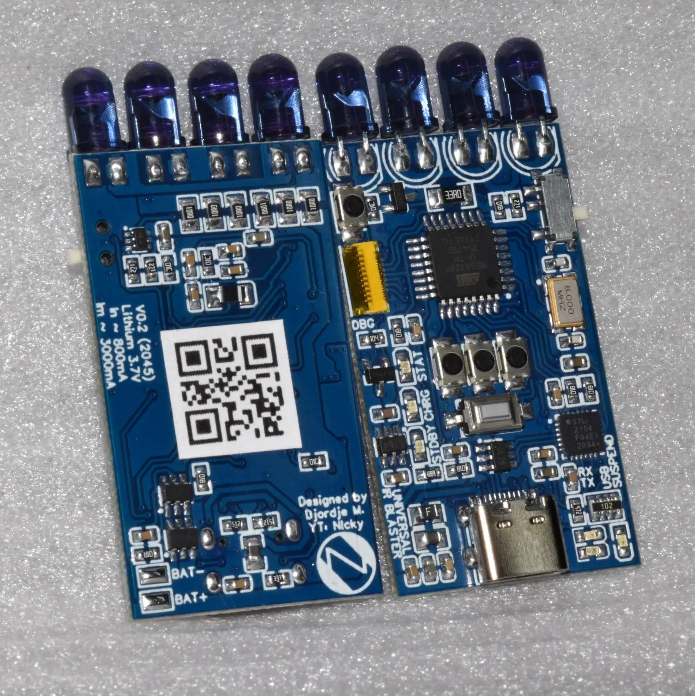
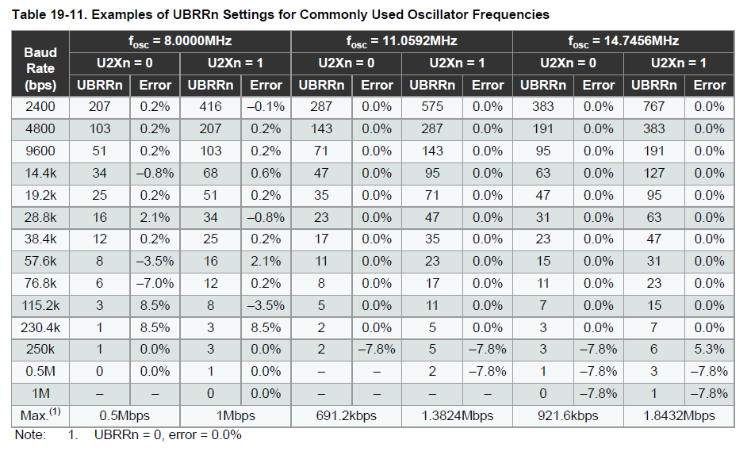

# GirsUIRB (based on [AGirs](https://github.com/bengtmartensson/AGirs))
 This is Girs infrared server for the Arduino ported and modified to work nicely with Universal IR Blaster V0.2 board with few modifications and addons. [MiniCore](https://github.com/MCUdude/MiniCore/) hardware package is used. GirsUIRB is compatible with [IrScrutinizer](https://github.com/bengtmartensson/IrScrutinizer) and [LIRC](https://www.lirc.org/). Until Universal IR Blaster V0.2 gets better documentation more info about hardware can be found [here](https://github.com/DjordjeMandic/Universal-IR-Blaster-TV-B-Gone).


# Getting started
Setup is straight forward but you will need to do some checks and mods for full functionality. Just PCBA of Universal IR Blaster V0.2 cannot work properly if you plan to transmit signals. Capture is also not possible without hardware mod. Receiving of demodulated signals can be done without any hardware mods.
## Hardware requirements and mods
 * ***Lithium battery***
    
    Battery is needed to supply high current to IR leds, without it board would not have stable power supply. You should chose a battery that can deliver up to 3A. I use 600mAh Li-Po battery for drones and it proved to be the good choice.
 * ***IR receiver and non-demodulated signal capture mod***
    
    In order to sense signals electrically we need a sensor. It can be demodulating aka ir receiver or non-demodulating aka ir sensor. For capture of raw signals we use non-demodulating sensor, for receiving modulated signals we use demodulating receiver. Non-demodulating sensor has much shorter range and sensitivity than demodulating receiver. 
    
    Capture with non-demodulating sensor(for example [TSMP58000](https://www.micros.com.pl/mediaserver/info-ootsmp58000.pdf)) is way to go if you're unsure what you're gonna receive. Raw capturing is done via PB0(ICP1) pin of ATMega328P and it cannot be changed. In order for it to work signal must be routed to pin 12 of TQFP package. I suggest that you do that via 10K resistor just to protect GPIO drivers inside ATMega328P. Signal also needs to be pulled up to VCC before entering 10K resistor and PB4(ICP1) must have internal pullup disabled. 
    
    If you're planning to receive a known signal then you should get yourself a demodulating receiver with right carrier frequency(for example [TSOP4838](https://www.vishay.com/docs/82459/tsop48.pdf) for 38kHz carrier). Receiving can be done with pins of your choice. This project has it set to PB4(MISO) with internal pullup enabled. External pullup is still recommended, 4.7k ohms is good for start.

    I'm using PB0(MISO) for rx ir signal since it's routed to flat cable connector on board. IR receiver modules that I have both use same pin for demodulated and non-demodulated signal but they're physically seperate modules. I decided to place 10K resistor between PB0(MISO) and PB4(ICP1) to use same pin on connector for both signals but not at same time. When I have non-demodulating sensor connected to board I'm using capture mode. When I have demodulating receiver connected then I use receive mode. My suggestion is to use different pin on flat cable connector for non-demodulating sensor signal so you can have sensor+receiver connected at same time. For example PB3(MOSI) could be connected to PB0(ICP1) via 10K resistor and then you could have both non-demodulated signal and demodulated signal on flat cable connector at same time. 
## Software requirements
 * [Visual Studio Code](https://code.visualstudio.com/)
 * [PlatformIO IDE](https://platformio.org/)
 * [CP210x USB to UART Bridge VCP Drivers](https://www.silabs.com/developers/usb-to-uart-bridge-vcp-drivers)
 * Clone of this repository on your computer
    ```
    git clone https://github.com/DjordjeMandic/GirsUIRB.git
    ```
## Uploading firmware
After everything is set up open the project folder in PlatformIO IDE. Connect Universal IR Blaster V0.2 to USB port of your computer. Select upload/monitor/test com port in IDE. Make sure that project enviroment is `env:Upload_UART (GirsUIRB)`. After everything is set execute `Upload and Monitor` task. Everything should upload go fine if you have latest urboot bootloader with autobaud flashed onto. Monitor should open and report current baud rate. For example `BAUD:38400:END`. If you don't see baud rate response in monitor at `38400` baud make sure that you have `double` with value of `0.2` written into chips eeprom at address `0x06`. You can use it as documented in [AGirs repo](https://github.com/bengtmartensson/AGirs). If upload does not work reduce the baud rate by selecting another project enviroment with slower baud rate. If upload still does not work you should start by [flashing bootloader and fuses](#flashing-bootloader-and-fuses). 

## Baud rate selection at startup
Default baud rate is set at `38400` baud. By holding option switces during chip startup/reset you can change baud rate. When starting COM port connection DTR resets the ATMega328P so you can basically hold option switch before opening COM port. Option switch 1 (left one) sets it to `9600` baud, option switch 2 (middle one) sets it to `19200` baud and last option switch 3 (right one) sets baud rate to `250000`. Note that IrScrutinizer does not have `250000` baud rate option, only `256000`. It's still less than 2.5% error on host side, works in my case. Firmware will always boot and report chosen baud rate in format `BAUD:<number>:END` at default baud rate of `38400` baud before switching to new `<number>` baud rate. Keep in mind that `250000` baud has most percise timing but `38400`, `19200`, `9600` are still good with only 0.2% error. Popular `115200` baud just does not work (hardware limitation). For more info take a look at Microchip document 7810D–AVR–01/15, page 164, Table 19-11. (photo below)



## Flashing bootloader and fuses
If you're having issues with upload via UART most likely is that you're running with [optiboot](https://github.com/Optiboot/optiboot) on your board which has been replaced by [urboot](https://github.com/stefanrueger/urboot). To flash new bootloader (which automatically sets the fuses) you need avr programmer(USBasp set by default in this project). Project enviroment `env:fuses_bootloader (GirsUIRB)` is set up to use USBasp as programmer. If you have different programmer go to `platformio.ini` and change `upload_protocol` under `[env:fuses_bootloader]` to protocol that suits your programmer. Note that you might also need to adjust `upload_flags` for `avrdude`.  More info can be found [here](https://docs.platformio.org/en/latest/platforms/atmelavr.html#upload-using-programmer). After that you need to turn off Universal IR Blaster V0.2 and disconnect it from USB. Connect programmer to ATMega328P and supply VCC from programmer (I used 3.3V from USBasp). Connect programmer to computer and select project enviroment `env:fuses_bootloader (GirsUIRB)` in PlatformIO IDE. Go to project tasks and under `Platform` folder you will have `Burn Bootloader`. Hit that and wait for it to finish. That will flash fuses and urboot bootloader with autobaud option. High baud rates work fine for me on my board and that's why I have 1M baud set. Bootloader itself is not set for specific baud rate, it always tries to automatically detect baud rate.

## TODO

- [x] Write README
- [ ] Separate capture and receive signals
- [ ] Create library for Universal IR Blaster V0.2 Hardware and use it here
- [ ] Create modules for AGirs to take full advantage of Universal IR Blaster V0.2 hardware library
- [ ] Implement autobaud
- [ ] Add status when doing nothing
- [ ] Add low battery indicator

## Some other projects with this board

- [TV-B-Gone on steroids using Universal IR Blaster board](https://github.com/DjordjeMandic/Universal-IR-Blaster-TV-B-Gone)

## License

This software project licensed under the GPL2 "or later" license, just as AGirs & Infrared4Arduino. For more info see [AGirs License](https://github.com/bengtmartensson/AGirs#license)
